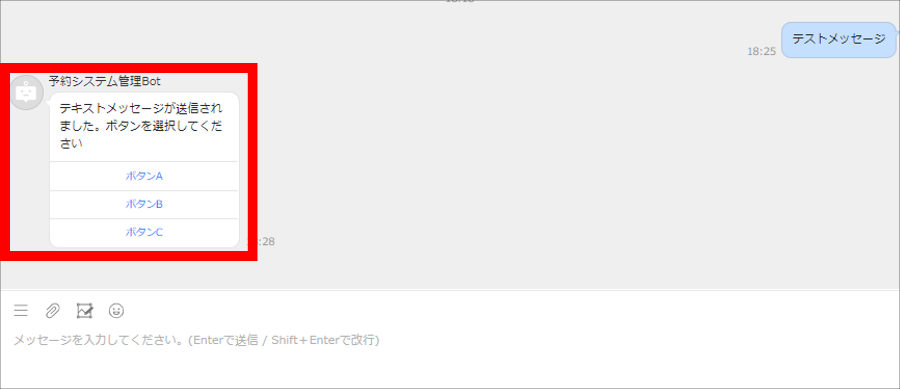

# LINE WORKS BotにMQを実装 サンプルコード

## 概要

コース「LINE WORKS API応用」のサンプルコードを、2つのサンプルプロジェクトに分割してメッセージキュー（MQ）を導入するようにしたサンプルコードです。

- LINE WORKSからのメッセージ受取部（パブリッシャー）：メッセージ送信先をLINE WORKSからAmazon MQに変更する
- Amazon MQからのメッセージ受取部（コンシューマー）：Amazon MQからメッセージを受け取り、そのメッセージをLINE WORKS APIを用いてBotへ送信する

LINE WORKS Botへ送信されるメッセージは「LINE WORKS API応用」のサンプルコードと同一です。

## 使用方法

### 前提条件

- Gradleがインストール済みである
- Java SE 17（LTS）がインストール済みである

### 事前準備

- AWSからAmazon MQを新規作成する

Amazon MQホーム画面：<https://ap-northeast-1.console.aws.amazon.com/amazon-mq/home?region=ap-northeast-1#/>

- LINE WORKSのアカウントを新規開設する

アカウント新規作成：<https://join.worksmobile.com/jp/joinup/step1>

- Developer ConsoleからLINE WORKS Botを新規作成する
- Developer Consoleからアプリを新規登録する

Developer Console：<https://dev.worksmobile.com/jp/console/openapi/v2/app/list/view>

- パブリッシャーとコンシューマーそれぞれの、`application.properties`で設定している環境変数の値を書き換える

### 起動

パブリッシャーとコンシューマーの両方を起動させることで、LINE WORKS APIを利用したメッセージ送信が行えるようになります。

#### パブリッシャーの起動

パブリッシャー側のルートディレクトリからターミナルを開き、以下のコマンドを実行してください。

```shell
./gradlew bootRun
```

以下のような起動画面が表示されます。

```txt
> Task :bootRun

  .   ____          _            __ _ _
 /\\ / ___'_ __ _ _(_)_ __  __ _ \ \ \ \
( ( )\___ | '_ | '_| | '_ \/ _` | \ \ \ \
 \\/  ___)| |_)| | | | | || (_| |  ) ) ) )
  '  |____| .__|_| |_|_| |_\__, | / / / /
 =========|_|==============|___/=/_/_/_/
 :: Spring Boot ::                (v3.1.0)
```

LINE WORKSからのCallbackを受信するために、Developer ConsoleのBot設定からCallback URLを設定してください。

Bot設定：<https://dev.worksmobile.com/jp/console/bot/view>

#### コンシューマーの起動

コンシューマー側のルートディレクトリからターミナルを開き、以下のコマンドを実行してください。

```shell
./gradlew bootRun
```

以下のような起動画面が表示されます。

```txt
> Task :bootRun

  .   ____          _            __ _ _
 /\\ / ___'_ __ _ _(_)_ __  __ _ \ \ \ \
( ( )\___ | '_ | '_| | '_ \/ _` | \ \ \ \
 \\/  ___)| |_)| | | | | || (_| |  ) ) ) )
  '  |____| .__|_| |_|_| |_\__, | / / / /
 =========|_|==============|___/=/_/_/_/
 :: Spring Boot ::                (v3.1.0)
```

パブリッシャーとコンシューマー両方のアプリケーションが起動すると、LINE WORKS Botへメッセージ送信ができるようになります。



## 問合せ先

`jsn-support@solxyz.co.jp`までお問合せください。
